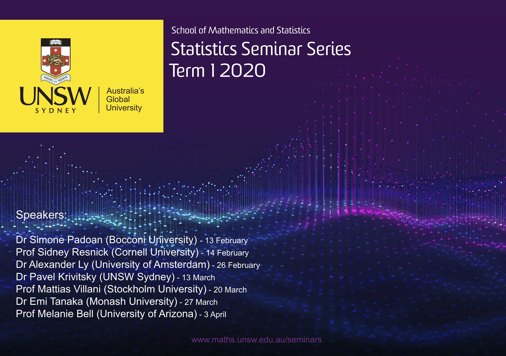

+++
# Project title.
title = "UNSW Statistics Seminar Series"

# Date this page was created.
date = 2016-04-27T00:00:00

# Project summary to display on homepage.
summary = "UNSW Statistics Seminar Series"

# Tags: can be used for filtering projects.
# Example: `tags = ["machine-learning", "deep-learning"]`
# tags = ["Deep Learning"]

# Optional external URL for project (replaces project detail page).
external_link = ""

# Slides (optional).
#   Associate this project with Markdown slides.
#   Simply enter your slide deck's filename without extension.
#   E.g. `slides = "example-slides"` references 
#   `content/slides/example-slides.md`.
#   Otherwise, set `slides = ""`.
# slides = "example-slides"

# Links (optional).
url_pdf = ""
url_slides = ""
url_video = ""
url_code = ""

# Custom links (optional).
#   Uncomment line below to enable. For multiple links, use the form `[{...}, {...}, {...}]`.
# url_custom = [{icon_pack = "fab", icon="twitter", name="Follow", url = "https://twitter.com/georgecushen"}]

# Featured image
# To use, add an image named `featured.jpg/png` to your project's folder. 
[image]
  # Caption (optional)
  caption = "Program for Term 1, 2019"
  
  # Focal point (optional)
  # Options: Smart, Center, TopLeft, Top, TopRight, Left, Right, BottomLeft, Bottom, BottomRight
  focal_point = "Smart"
+++

The UNSW Statistics Seminar Series are usually held on Fridays at 4pm during the teaching period. The program for the current term is given in the flyer below. Please visit the [School of Mathematics and Statistics webpage](https://www.maths.unsw.edu.au/seminars?term_node_tid_depth_3=205) closer to the seminar date to access the location details and topic. 

